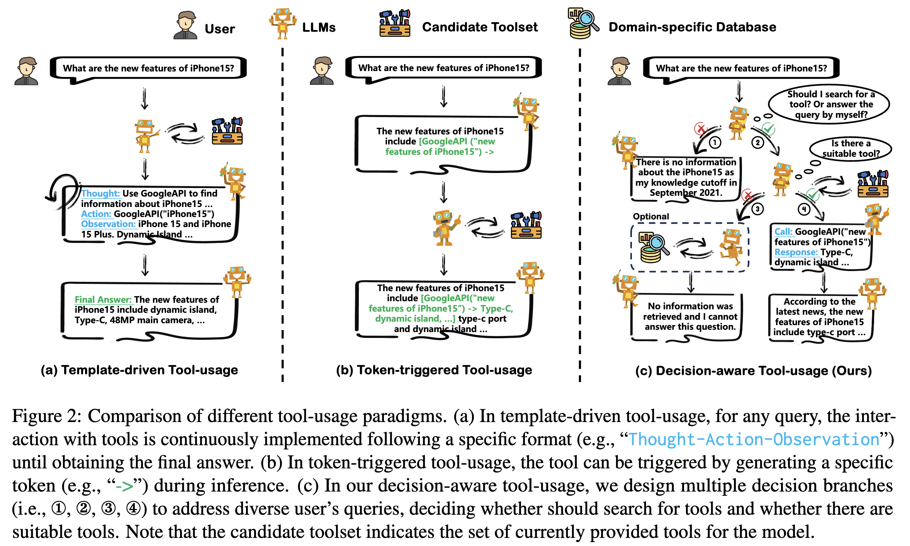
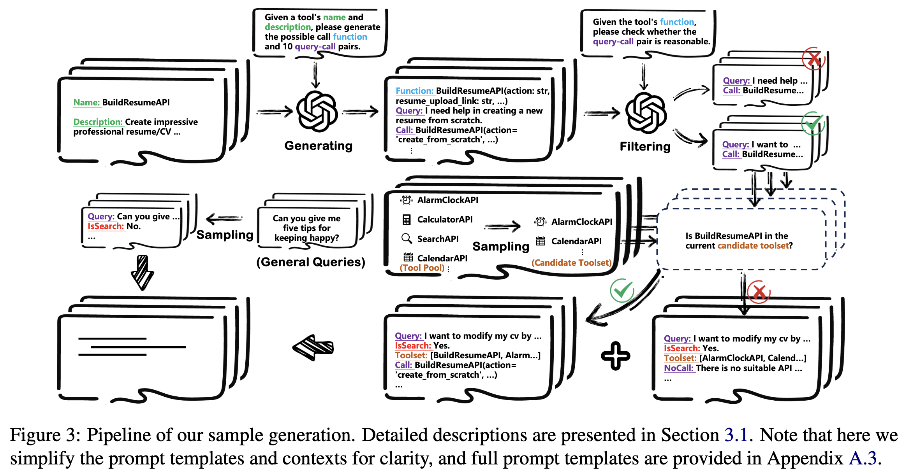
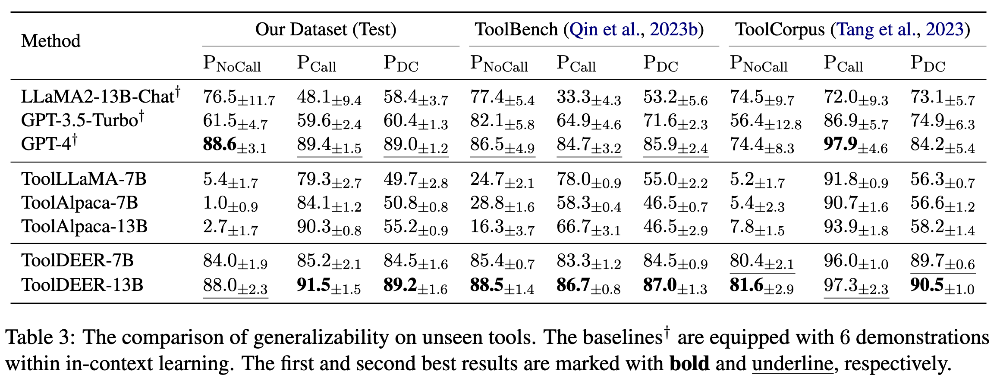
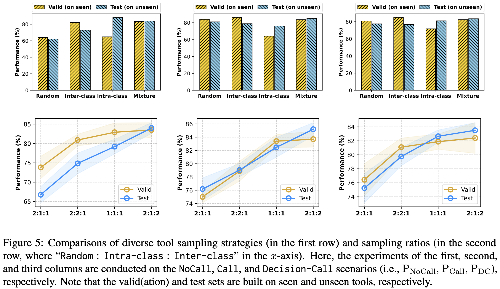

<p align="center" width="100%">
</p>

<div id="top" align="center">

Look Before You Leap: Towards Decision-Aware and Generalizable Tool-Usage for Large Language Models
-----------------------------
 


<h4> |<a href="https://arxiv.org/abs/2402.16696"> 📑 Paper </a> |
<a href="https://github.com/Ericmututu/ToolDEER"> 🐱 GitHub </a> |
</h4>

</div>


## Overview
Tool-augmented large language models (LLMs) are attracting widespread attention when accessing up-to-date knowledge and alleviating hallucination issues.
Nowadays, advanced closed-source LLMs (e.g., ChatGPT) have demonstrated surprising tool-usage capabilities through prompting and in-context learning techniques.
To empower the capabilities of open-source LLMs (e.g., LLaMA) in manipulating tools, current efforts focus on either template-driven or token-triggered tool-usage.
However, the former hampers LLMs' flexibility to address diverse user's queries due to constrained tool interactions, while the latter limits the generalizability when engaging with new tools, since tool-usage learning is based on task- and tool-specific datasets.
To alleviate these concerns, in this paper, we propose a <u>de</u>cision-aware and gen<u>er</u>alizable tool-usage framework (DEER).
Specifically, we first construct the tool-usage samples with multiple decision branches via an automatic generation pipeline, thereby inspiring the decision-making awareness of LLMs under diverse scenarios.
Meanwhile, we propose a novel tool sampling strategy to enhance the generalizability of LLMs over unseen tools.
Extensive experiments demonstrate that our proposed DEER is effective and significantly outperforms baselines across various datasets.

<p align="center">
     <br>
</p>


## Quick Start

### Setup
Install the libraries listed in `requirements.txt`.
```bash
pip install -r requirements.txt
```

### Generate tool's function and query-call pairs
```bash
cd ToolDEER/
python3 src/generate_tool.py --data_path data/raw/chatgpt_plugins.json --write_to_path data/processed/tool.json
```
Download the `chatgpt_plugins.json` from [here](https://github.com/copilot-us/chatgpt-plugins/tree/main), then move to `data/raw/`.

### Construct the multi-decision tool-usage datasets
The pipeline of our multi-decision sample generation.

<p align="center">
     <br>
</p>

```bash
cd ToolDEER/
python3 src/generate_dataset.py --tool_path data/processed/tool.json --general_path data/raw/${general_filename} --save_dir data/processed/
```
Download the general dataset from [here](https://huggingface.co/datasets/YeungNLP/WizardLM_evol_instruct_V2_143k).


### Finetuning using LoRA
```python
export WANDB_MODE="disabled"

CUDA_VISIBLE_DEVICES=0,1,2,3,4,5,6,7 deepspeed --master_port=20002 src/train_lora.py \
    --model_name_or_path ${llama2_7b_ckpt_dir}/ \
    --data_path data/processed/train.json \
    --bf16 False \
    --output_dir outputs/ \
    --num_train_epochs 10 \
    --per_device_train_batch_size 4 \
    --per_device_eval_batch_size 4 \
    --gradient_accumulation_steps 1 \
    --save_strategy "steps" \
    --save_steps 10000 \
    --save_total_limit 10 \
    --learning_rate 5e-4 \
    --weight_decay 0. \
    --warmup_ratio 0.04 \
    --lr_scheduler_type "cosine" \
    --logging_steps 20 \
    --model_max_length 2048 \
    --gradient_checkpointing True \
    --lazy_preprocess True \
    --deepspeed configs/stage2.json
```

### Evaluation
```bash
cd ToolDEER/
python3 src/inference.py --model_name_or_path ${llama2_7b_ckpt_dir}/ --lora_path outputs --data_path data/processed/valid.json
```

The comparison with baselines on unseen tools.
<p align="center">
     <br>
</p>

The comparison of diverse tool sampling strategies and corresponding sampling ratios.
<p align="center">
     <br>
</p>


## Citation
If you find this work is helpful to your research or applications, please feel free to cite our work.
```
@article{gui2024look,
  title={Look Before You Leap: Towards Decision-Aware and Generalizable Tool-Usage for Large Language Models},
  author={Gui, Anchun and Li, Jian and Dai, Yong and Du, Nan and Xiao, Han},
  journal={arXiv preprint arXiv:2402.16696},
  year={2024}
}
```

## Acknowledgments
This project partially refers to [ToolLLM](https://github.com/OpenBMB/ToolBench) and [ToolAlpaca](https://github.com/tangqiaoyu/ToolAlpaca). Thanks for their wonderful work!
